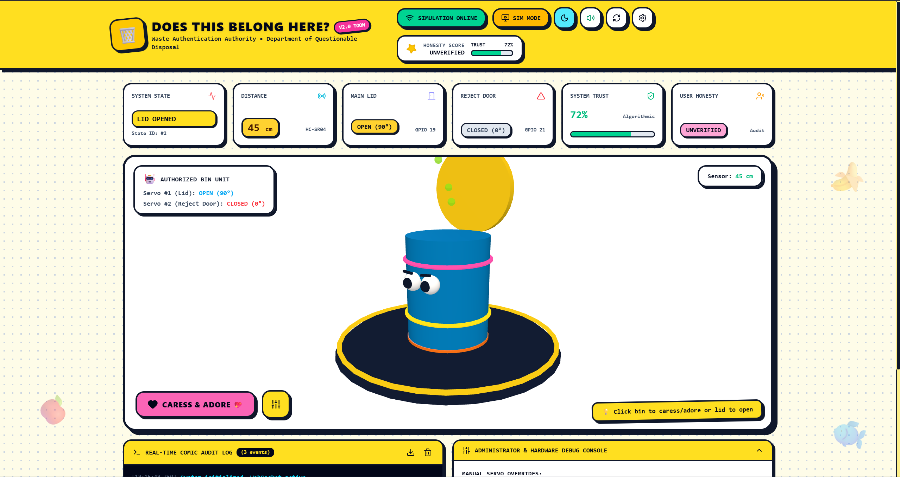
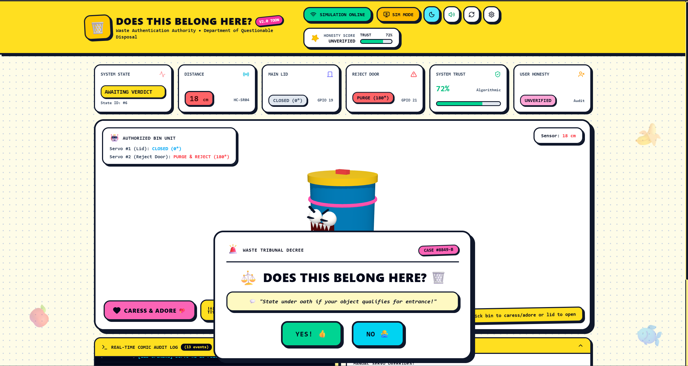
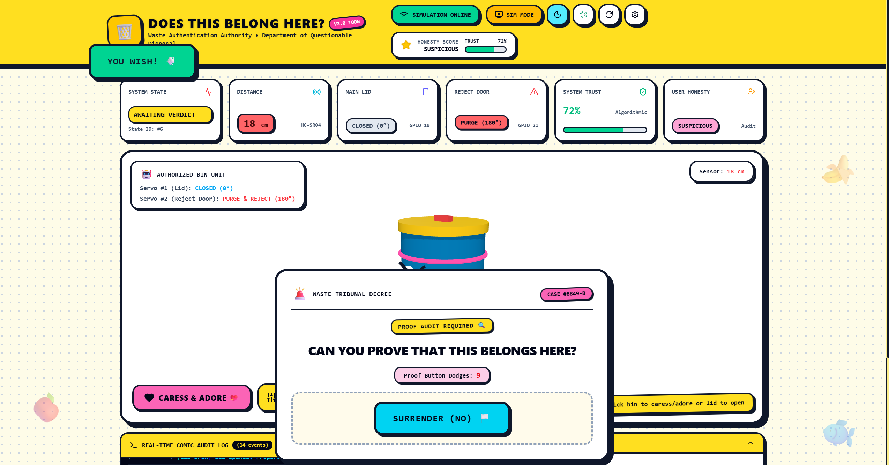
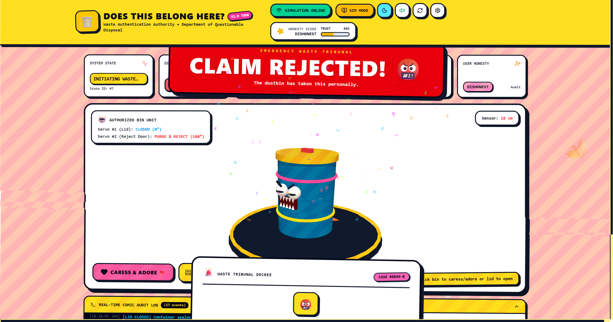
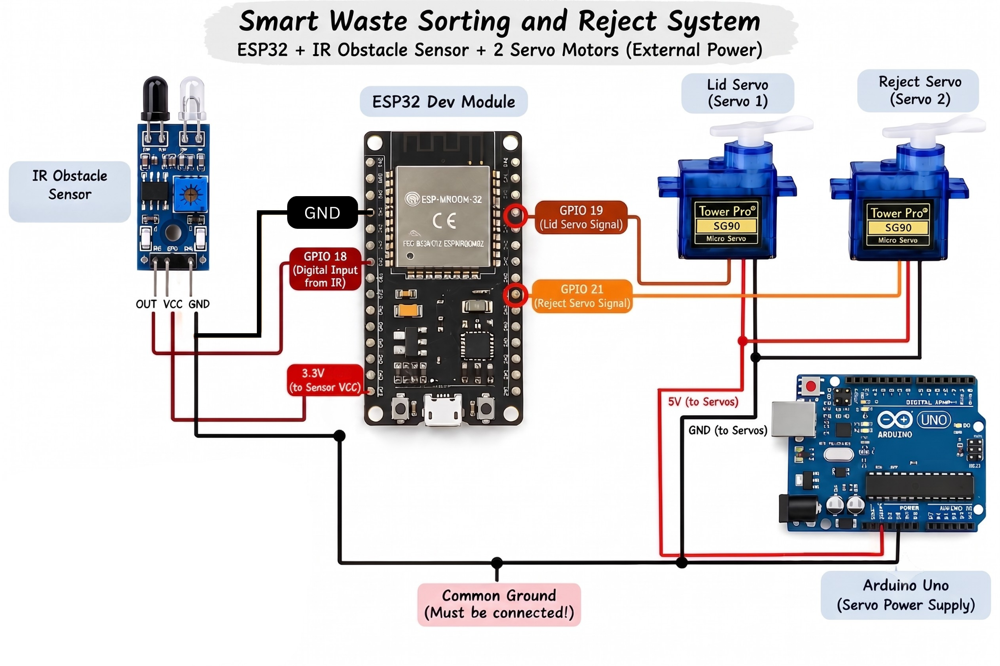
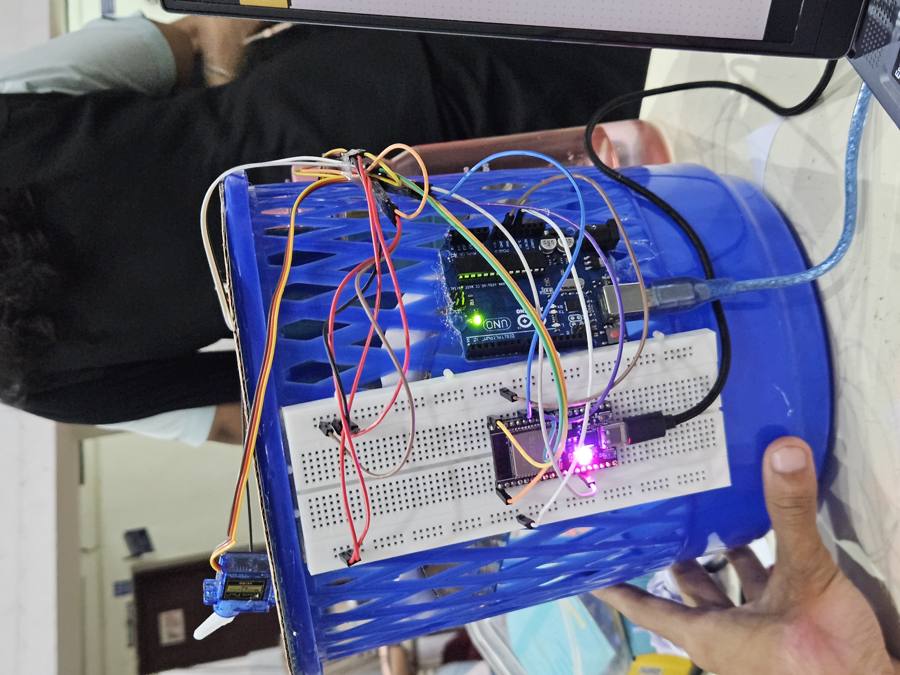
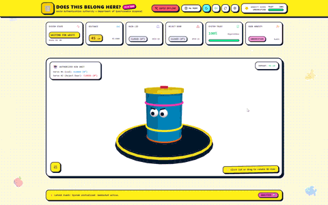

# DOES THIS BELONG HERE? 🎯


## Basic Details
### Team Name: Useless Duo


### Team Members
- Team Lead: Anshias Anto - Jyothi Engineering College
- Member 2: Vaishnav C - Jyothi Engineering College

### Project Description
Meet Teeku, our beloved trashbin and probably the most emotionally neglected member of our team. Every day, people throw their waste at her without asking how she feels. So we decided to give Teeku a voice, a brain, and the power to decide what belongs to her.

### The Problem (that doesn't exist)
Every day, we watched Teeku suffer in silence. People approached her, threw random things at her, and walked away without even a “thank you.” She has a soft heart, but nobody respects her feelings. The worst part? She couldn't even say NO.

### The Solution (that nobody asked for)
We gave Teeku what she always deserved: a little intelligence and a lot of attitude. With an IR sensor, servos, ESP32, and a fancy dashboard, Teeku can detect people, open her lid, question their waste, and reject it when she's not in the mood. Because sometimes, a trashbin just needs boundaries. 😂
## Technical Details
### Technologies/Components Used
For Software:
- Languages: TypeScript, JavaScript, HTML, C++ (Arduino/ESP32)
- Frameworks: React 18, Vite
- Libraries: Three.js, `@react-three/fiber`, `@react-three/drei`, Canvas Confetti, Lucide React, WebSockets
- Tools: VS Code, npm, Web Audio API

For Hardware:
- Main components: ESP32 Dev Module, 2x SG90/MG90S Servo Motors, FC-51 IR Obstacle Sensor Module
- Specifications: GPIO 18 (IR Sensor), GPIO 19 (Lid Servo), GPIO 21 (Rejection Servo), 5V DC Power (Common Ground to ESP32)
- Tools required: Arduino IDE, Soldering Iron, Jumper Wires, 5V Power Supply

### Implementation
For Software:
# Installation
```bash
cd dashboard
npm install
```

# Run
```bash
npm run dev
```

### Project Documentation
For Software:

# Screenshots (Add at least 3)

**Initial State:* The dashboard displays the system status, sensor readings, servo positions, and the cartoon dustbin opens the lid when the sensor detects an object..*


**Waste Detection & Verdict:* The system detects an object and presents the user with the question *“DOES THIS BELONG HERE?”* along with YES and NO options.*


**Confirmation Stage:* After selecting YES, the system challenges the user with a proof/audit prompt, making the YES option intentionally difficult to select.*


**Rejection & Angry Mode:* When the user finally selects NO, the system rejects the waste with an angry cartoon animation, screen effects, and the message *“CLAIM REJECTED!”**


# Diagrams
```
[ IR Sensor (GPIO 18) ] ---> ( Detects Person / Waste )
                                       |
                                       v
[ ESP32 Microcontroller ] <=== ( WebSocket Port 81 ) ===> [ React + Three.js Web Dashboard ]
   |                  |                                               |
   | (GPIO 19)        | (GPIO 21)                                     v
   v                  v                                     [ Waste Tribunal Case ]
( Lid Servo )    ( Reject Door Servo )                             - "DOES THIS BELONG HERE?"
                                                                   - Full-Screen Evasive YES Button
                                                                   - Surrender / Reject Trigger
```
*System Workflow & Hardware Architecture Diagram*

For Hardware:

# Schematic & Circuit

*Hardware circuit wiring displaying ESP32 GPIO 18 (IR Sensor), GPIO 19 (Lid Servo), GPIO 21 (Rejection Servo) and 5V Common Ground connection.*


*Physical mechanical schematic showing dual-servo trapdoor assembly for top intake and bottom rejection.*

# Build Photos


*Final completed physical build of the DOES THIS BELONG HERE? Smart Dustbin.*

### Project Demo
# Video

*Demonstrates the WebGL 3D dashboard, Waste Tribunal case popup, sound effects, and full-screen evasive YES button physics.*

# Additional Demos

*Shows the physical ESP32 bin detecting waste, opening the top lid, receiving WebSocket commands, and triggering the bottom rejection door to dump waste.*

## Team Contributions
- Anshias Anto: Developed the React 3D Dashboard, WebGL Three.js bin model, WebSocket client service, full-screen evasive button physics & clamping algorithm, retro-cartoon design system, and custom Web Audio sound engine.
- Vaishnav C: Designed the ESP32 state machine firmware, IR sensor threshold tuning, dual servo actuation mechanics (Lid Servo & Rejection Trapdoor), circuit power wiring, and physical bin chassis assembly.

---
Made with ❤️ at TinkerHub Useless Projects 


